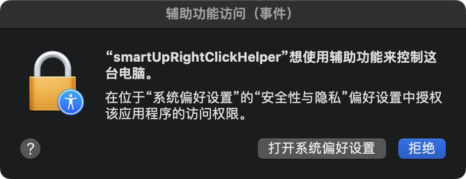
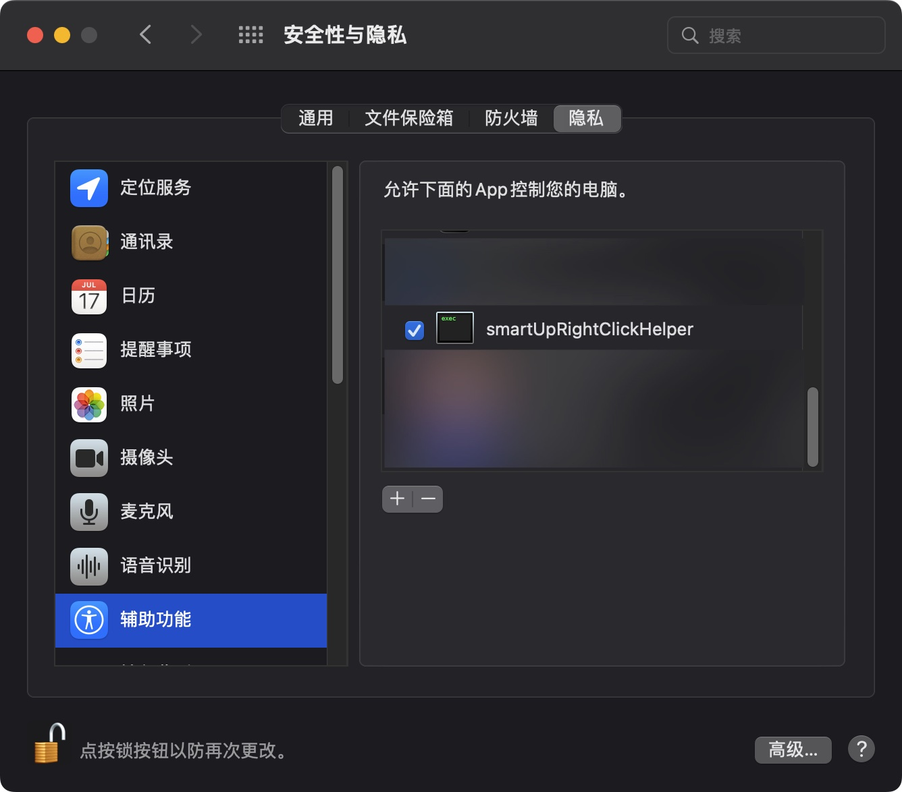

# smartUp手势 

一个更好的手势类扩展。功能包括：鼠标手势，简易拖曳，超级拖曳，摇杆手势和滚轮手势。

[](https://github.com/zimocode/smartup/issues)
[](https://github.com/zimocdoe/smartup/members)
[](https://github.com/zimocode/smartup/stargazers)
[](LICENSE)

[English](README.md) ·[简体中文](README-zh_CN.md)

## 安装右键助手
当前右键助手已经切换为 Rust 实现。
先在`rightClickHelper`目录中构建，再执行仓库根目录的安装脚本。

构建命令如下：

```shell
# 通用 Rust helper 二进制
(cd rightClickHelper && cargo build --release)

# macOS arm64 app bundle（本机开发，使用 ad-hoc 签名）
(cd rightClickHelper && ./build-darwin-arm64-app.sh --dev)

# 如果你有开发者证书，可显式传入签名身份
# (cd rightClickHelper && ./build-darwin-arm64-app.sh --sign "Developer ID Application: Your Name (TEAMID)")

# 安装到 ~/Applications 并写入 Native Messaging manifest
./installRightClickHelper.sh
```

说明：`build-darwin-arm64-app.sh` 现在必须显式选择 `--dev` 或 `--sign`，默认无参数会直接报错。

Linux 运行时要求：

- 运行在 **X11** 会话下
- 系统中已安装 `xdotool`

Rust helper 启动后若标准输出出现类似下列内容，说明 Native Messaging host 已正常启动：

```shell
{"version":"0.9.0"}
```

### macOS第一次点击右键时，会有授权弹窗提示



### 按图授权后，重启浏览器即可。


